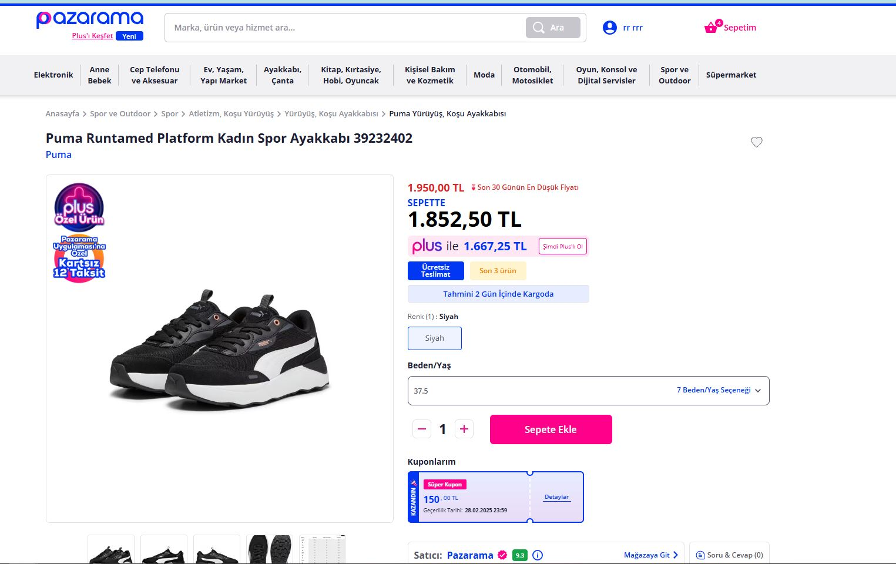
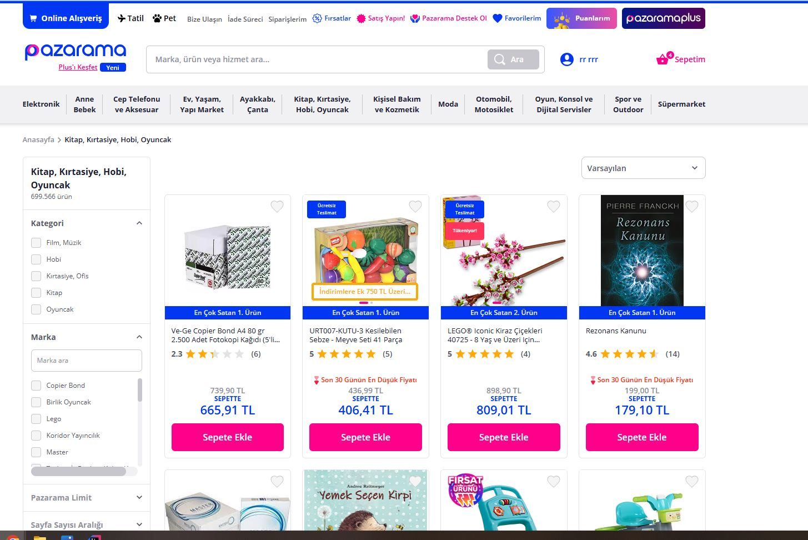
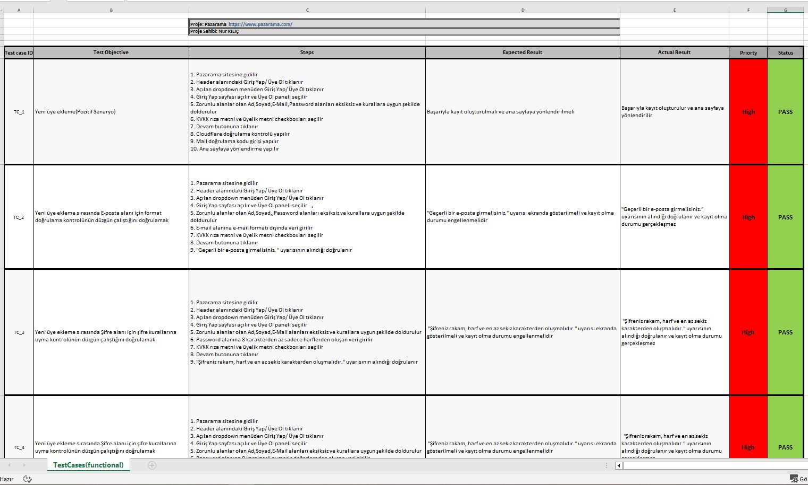
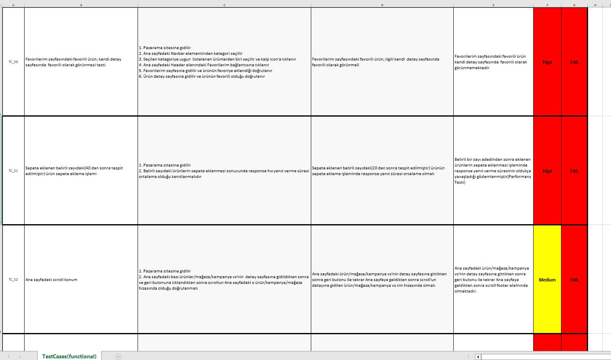
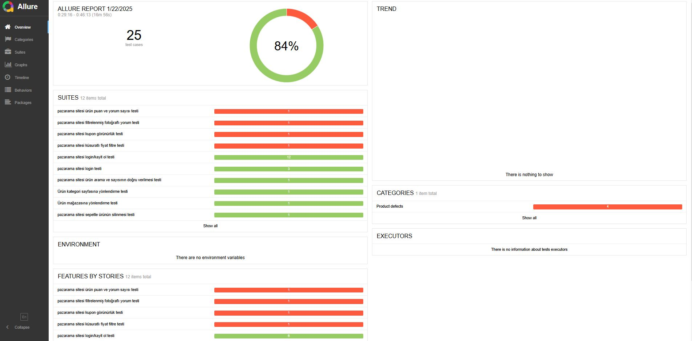
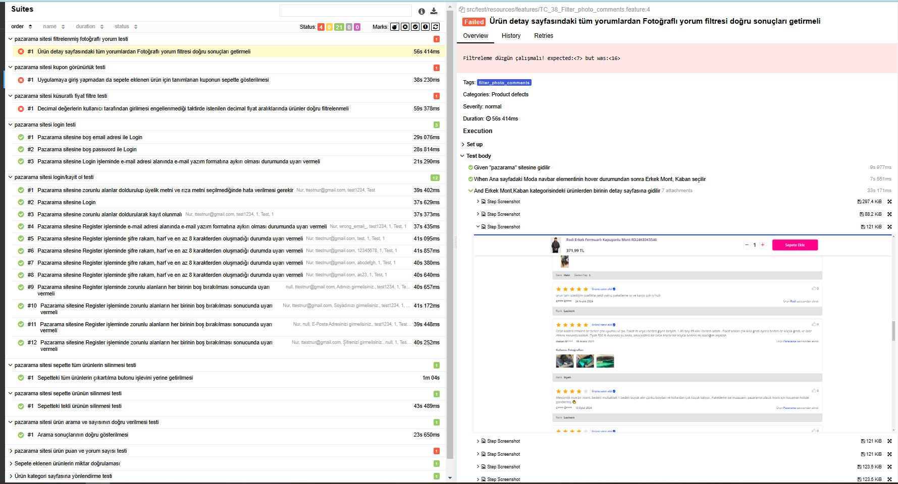
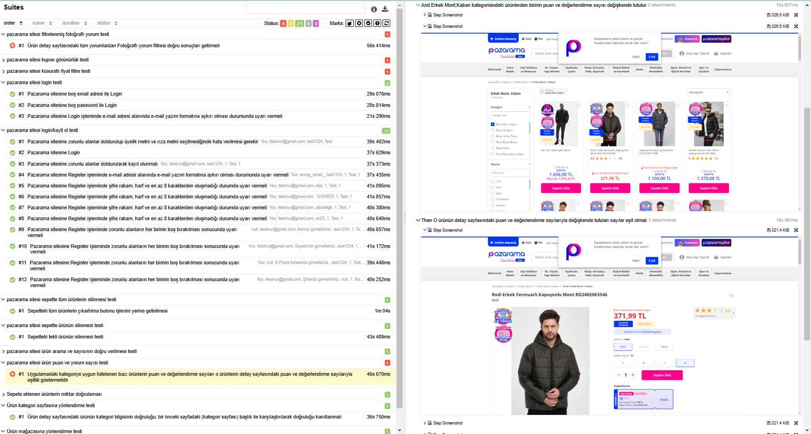

# Pazarama.com Automation Test (Selenium)

### Website : [https://www.pazarama.com/]

## :earth_africa: Website:

## About this project:
As a fundamental part of the automation testing conducted on the Pazarama.com website, core functions such as registration, login, user operations, cart operations, product filtering, and the product review panel were thoroughly tested. Throughout this process, the system's functionality was analyzed to identify potential errors and evaluate its accuracy, reliability, and overall user experience.

## :100: The project includes manuel test cases(53 test cases)

 ## :wrench: Tools:
+ IntelliJ IDEA
+ Maven
+ Selenium WebDriver
+ TestNG
+ Cucumber
+ Allure Report

## :bar_chart: Report generated by Allure:

  
